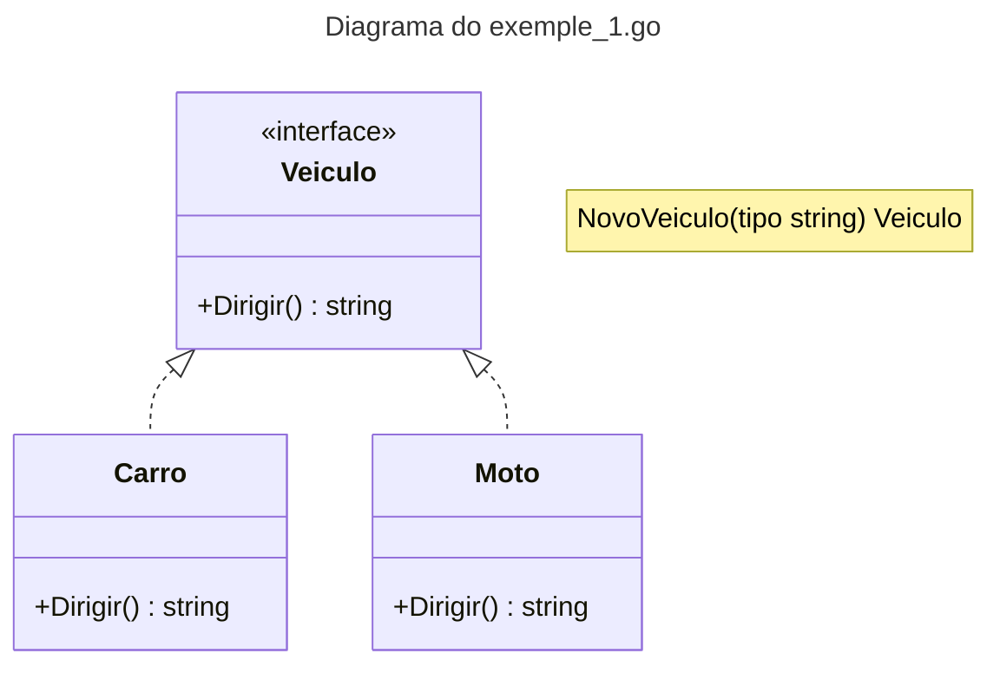

# Factory Method



### Exemplos de lib go que usam o Factory Method

O Factory Method é um padrão de projeto criacional que fornece uma interface para criar objetos em uma superclasse, mas permite que as subclasses alterem o tipo de objeto que será criado. Esse padrão promove a inversão de controle, delegando a responsabilidade da criação dos objetos para subclasses ou funções especializadas.

A função `sql.Open(driverName, dataSourceName string) (*sql.DB, error)` atua como uma Factory Method, pois retorna uma instância de `*sql.DB`, mas permite que o usuário escolha qual driver será utilizado.

```go
package main

import (
    "database/sql"
    "fmt"
    "log"

    _ "github.com/lib/pq" // Importa o driver do PostgreSQL
)

func main() {
    // Criando um objeto *sql.DB usando a Factory Method sql.Open
    db, err := sql.Open("postgres", "user=postgres password dbname= sslmode=disable")
    if err != nil {
        log.Fatal(err)
    }
    defer db.Close()

    fmt.Println("Banco de dados conectado com sucesso!")
}

```

Como isso segue o Factory Method?

`sql.Open` atua como uma Factory Method porque esconde a lógica de criação da conexão.

Diferentes drivers → O usuário pode trocar `postgres` por `mysql`, `sqlite3`, etc., e a factory retornará um `*sql.DB` adequado.

Abstração → O código do usuário não precisa saber os detalhes internos da conexão.

### Referencias

[Refactoring guru](https://refactoring.guru/pt-br/design-patterns/factory-method)
